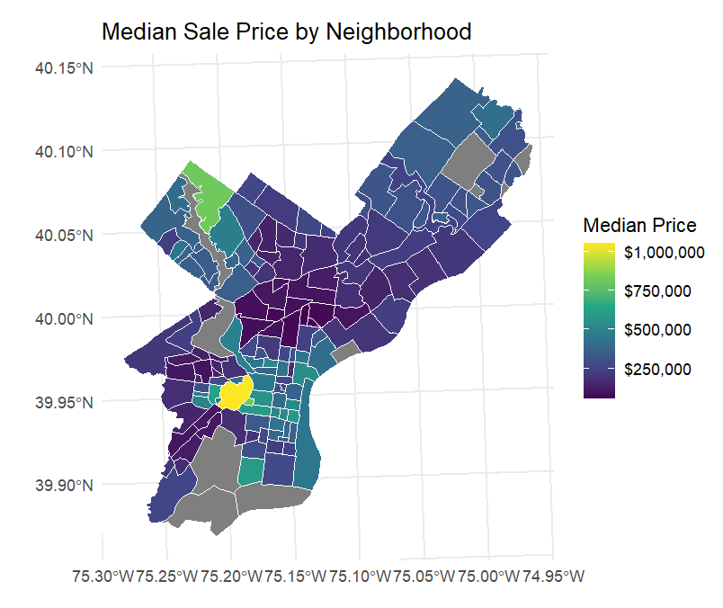
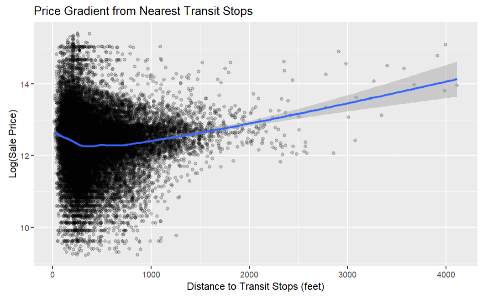
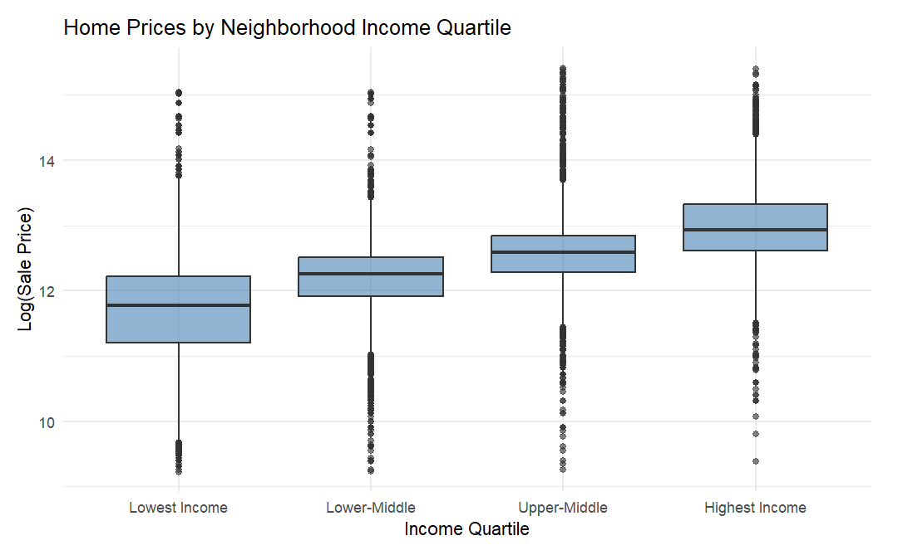

# Predicting Housing Prices in Philadelphia {background-color="#436b95"}
**Improved Model for Property Tax Assessment**  
Mackenna Amole, Gab Chen, Angie Kwon

# Framework & Foundations {background-color="#b0c4de"}

## Who We Are & Why We're Here
- AKC/onsultants 
  - Using our **experience**, we have developed a **new and improved Automated Valuation Model** for Philadelphia's property tax assessments.

- Philadelphia is full of **prime real estate!**
  - **What factors influence home price?** How can we capture every important factor to efficiently and effectively determine home prices across the city?

## Data Sources
:::: {.columns}
::: {.column width="50%"}
- **Property Sales**
- **Census ACS : 2024 / Philadelphia County Tracts **
  - Median Home Value
  - Median Household Income
  - Poverty Count & Total (Calculate Percentage)
  - Total Education & Bachelors, Masters, PHDs (Sum Bachelors or Higher, Calculate Percentage)
  - Total Population
  - Total Tenure & Owner Occupancy (Calculate Percentage)
:::
::: {.column width="50%"}
- **OpenDataPhilly : 2023**
  - Crime Data
  - Green Space (as PPR Properties)
  - Hospitals
  - Landmarks
  - Schools
  - Traffic Safety (as Crash Data)
  - Transit Stops
:::
::::

# Findings {background-color="#b0c4de"}

## Visualizations

## Visualizations

## Visualizations

## Model Cross-Validation Results
| Model Name | Variables | RMSE     | Adjusted R-Squared| MAE|
|:------:    | :------:        | :------: | :------: | :------: |
| model2    | Structural  | 0.543 | 0.3219 | 0.347 |
| model3_2    | Structural & Census  | 0.526 | 0.5563 | 0.334 |
| model4    | Spatial, Structural & Census  | 0.525 | 0.5601 | 0.332 |
| model6_5 | Spatial, Structural, Census & Fixed Effects   | 0.523 | 0.5935 | 0.330 |

- At times, included **too many variables** --> cut down number
- When a model decreased in adjusted r-squared, we looked into **significance** of included variables --> removed statistically insignificant variables
- Iterations with average distance to the 3-5 nearest neighbors of different factors found these variables to be **highly inaccurate** in model --> used buffers instead

## Selected Model & Its Performance
- **Final Model:** RMSE : 0.523 / Adjusted R-Squared : 0.5935 / MAE : 0.330
- **Included Factors**
  - **Structural:**  Livable area, Number of Bathrooms, Number of Bedrooms, Age
  - **Census:**  Median Household Income, % of Population with College Degree, Poverty Rate, % of Owner Occupied Units, % White Population, % Black Population, % People Commuting via Car, % People Commuting via Transit, % People Working Remote/From Home, Population Density
  - **Spatial:**  Parks (2 mi), Transit (0.25 mi), Schools (2 mi), Crime (0.25 mi), Crash (0.25 mi), Hospitals (2 mi), Landmarks (0.5 mi)
  - **Fixed Effect:**  Neighborhood
  - **Interaction:**  Crime & Median Income, Parks & Median Income, Landmarks & Total Livable Area, Distance to Downtown & Transit, Distance to Downtown & Total Livable Area, Age & Total Livable Area, Owner Occupancy & Total Livable Area, Rent Burden & Black Population, Number of Stories & Median Income
  - **Logged Variables:**  Age, Distance to Downtown

## Limitations
- **1** RMSE indicates that our final model has a **59% error**.
- **2** Only **multicolinearity and no influential outliers assumptions** confidently met. Linearity, constant variance, and normality of residuals were very tentatively met, if that.
- **3** Overall, requires many **different variables which can be difficult and costly to collect**. In spite of so many variables being included, the cost may not be worth the benefit because the predictability of the model is still limited.

## Policy Recommendations 
- **1 - Racial Considerations**  
Explore the racialized aspect of sales price differences.
- **2 - Housing Over History**   
Ensure preserving historic neighborhoods won't be prioritized over housing for the present.
- **3 - Small Neighborhood Limitations**   
Find a better way to study smaller neighborhoods as a variable.

# Thank You {background-color="#436b95"}
AKC/onsultants