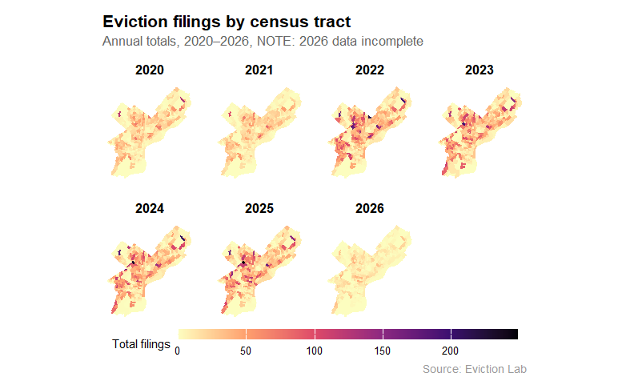
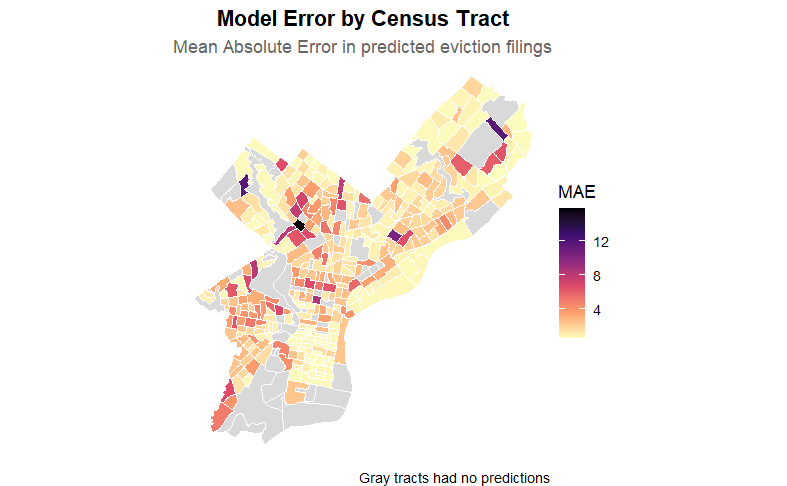
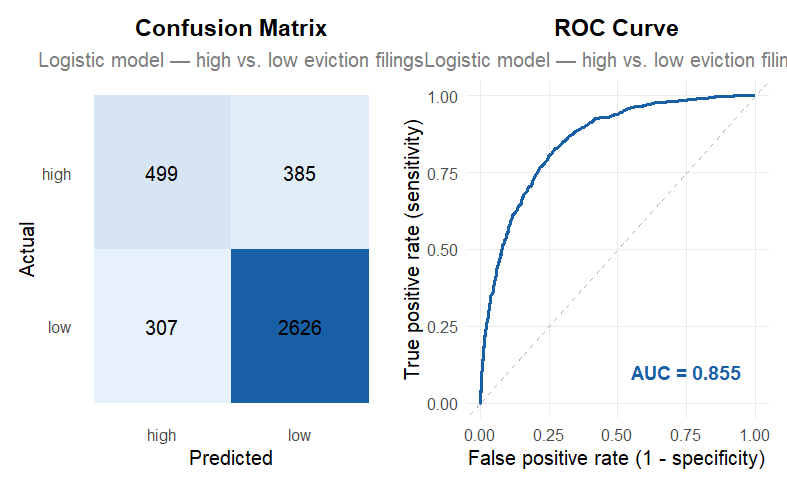

# Predicting Eviction in Philadelphia {background-color="#ffc58b"}

**Improved Model for Tracking Evictions**\
Mackenna Amole, Ethan Harner, Angie Kwon

# Problem Statement & Planning Context {background-color="#ffc58b"}

## The Problem

Evictions are an indicator of instability and they are unevenly distributed across Philadelphia. Planning efforts targeting evictions address and identify patterns after spikes in counts. This is reactive. Effective planning efforts should be proactive, able to follow patterns and predict which neighborhoods (tracts) will have higher counts in a month.

## Research Question

### Which tracts in Philadelphia will be in the **top 25% of evictions in any given month**?

This framework shifts aware from a simple count and helps to identify citywide patterns.

## Impact for Planning

1.  Predicting areas impacted heavily by evictions monthly
2.  Work with predicting - proactive vs. reactive

# Data, Integration, & Methods {background-color="#ffc58b"}

## Variables

- Census, Demographic, & Housing
  - Housing Cost & Gross Rent
  - Rent Burden (% of households)
  - Income Level
  - Age of Housing
  - Household Tenure (% of households renting vs. owning)
  - Unemployment Rate
  - Racial Majority
  - Poverty Rate
  - Proportion of Renters with Housing Vouchers
  - Gender (%)
- Spatial
  - Census Tract Geography Fixed Effects
  - Vacant Lots
- Temporal
  - Cyclical - Lease endings - Monthly & Yearly Lags
  - Pandemic-Era Eviction Moratorium
  - Outliars Significantly Below Pre-Pandemic Baseline

## Data Sources

- Eviction Lab Philadelphia Monthly Eviction Data 2020-2026
  - https://evictionlab.org/eviction-tracking/get-the-data/
- Census ACS 5-Year Estimates: 2024 / Philadelphia County Tracts
  - Downloaded using getacs in R
- OpenData Philly
  - Housing Choice Voucher data
  - Vacant property indicators

## Methods

### Exploratory Data Analysis (EDA)

- Evictions dropped sharply during COVID-19 due to moratorium policies
- Data remained unstable through 2022
- Post-2022 trends stabilized → used for modeling
- Persistent spatial clustering in North and West Philadelphia

### Modeling Strategy

We tested two approaches:

**1. Count Models** - Poisson regression - Negative binomial regression - Used to predict eviction counts - Finding: Limited prediction accuracy

**2. Classification Model (Final Approach)** - Logistic regression predicting: - High-risk tracts (top 25%) vs. low-risk - Why this works better: - More aligned with policy decisions - More stable so better to interpret - Better predictive performance

# Results, Performance, & Evaluation {background-color="#ffc58b"}

## Exploratory Visualizations

## Exploratory Visualizations

## Exploratory Visualizations

## Model Visualizations

## Model Visualizations

## Key Findings

- Past evictions strongly predict future evictions
- Logit model better for predicting higher risk areas than the count model

# Implementation {background-color="#ffc58b"}

## Policy Recommendations

1.  

2.  Deploy **eviction prevention resources** like housing counsel or emergency rental assistance in areas that will have higher eviction counts the following month

3.  

## Limitations & Considerations

- Model is better at predicting relative risk, not exact counts
- Strong dependence on lag variables limits long-term forecasting
- Census data is static and may not reflect rapid neighborhood change
- May reinforce patterns in historically disadvantaged areas (think: predictive policing example)
- Offer transparency in model forecasting upon implementation

# Thank You {background-color="#ffc58b"}

Questions?
